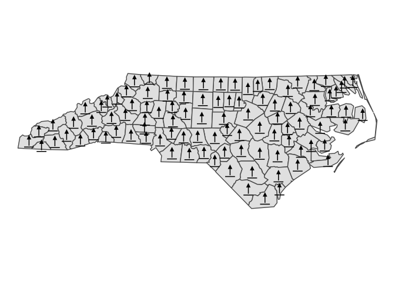
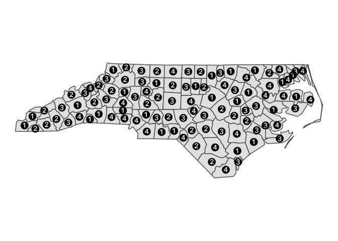
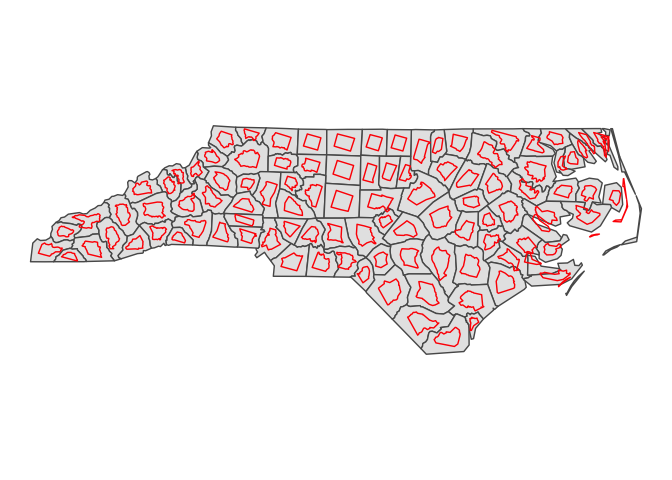
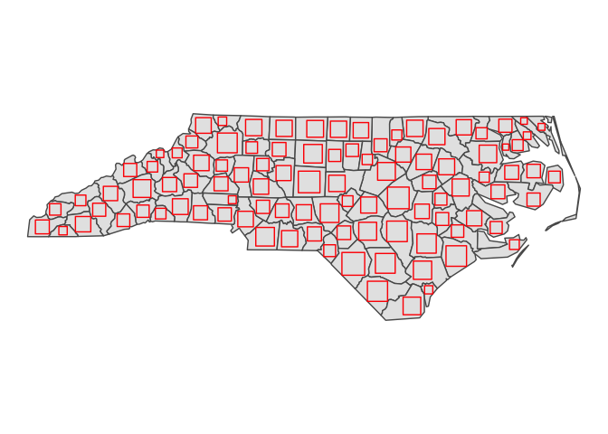
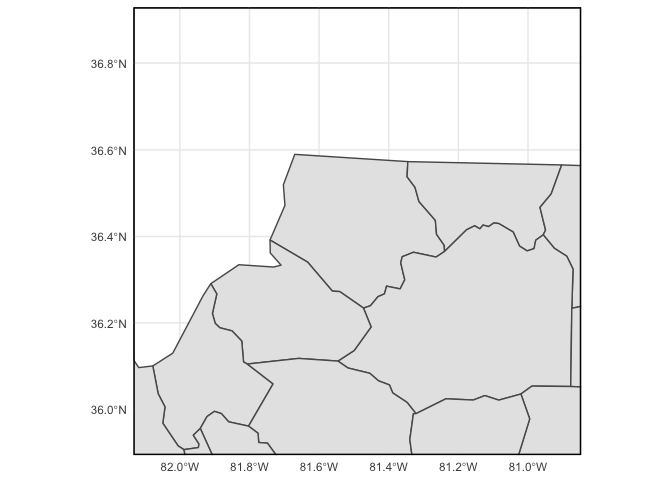

<!-- README.md is generated from README.Rmd. Please edit that file -->

# overedge

<!-- badges: start -->

[](https://CRAN.R-project.org/package=overedge)
[](https://lifecycle.r-lib.org/articles/stages.html#experimental)
[](https://opensource.org/licenses/MIT)
[](https://app.codecov.io/gh/elipousson/overedge?branch=main)
<!-- badges: end -->

The goal of overedge is to provide useful functions for making maps with
R. This is a collection of miscellaneous functions primarily for working
with ggplot2 and sf.

## Installation

You can install the development version of overedge like so:

``` r
remotes::install_github("elipousson/overedge")
```

## Examples

`overedge` currently provides a variety of functions for accessing
spatial data, modifying simple feature or bounding box objects, and
creating or formatting maps with ggplot2.

### Make icon maps with sf objects and ggplot2

`geom_sf_icon` wraps `ggsvg::geom_point_svg()` to provide an convenient
way to make icon maps.

You can create maps using a single named icon that matches one of the
icons in `map_icons`.

``` r
library(overedge)
library(ggplot2)
library(sf)
#> Linking to GEOS 3.9.1, GDAL 3.4.0, PROJ 8.1.1; sf_use_s2() is TRUE

nc <- st_read(system.file("shape/nc.shp", package = "sf"))
#> Reading layer `nc' from data source 
#>   `/Library/Frameworks/R.framework/Versions/4.1/Resources/library/sf/shape/nc.shp' 
#>   using driver `ESRI Shapefile'
#> Simple feature collection with 100 features and 14 fields
#> Geometry type: MULTIPOLYGON
#> Dimension:     XY
#> Bounding box:  xmin: -84.32385 ymin: 33.88199 xmax: -75.45698 ymax: 36.58965
#> Geodetic CRS:  NAD27
nc <- st_transform(nc, 3857)
theme_set(theme_void())

nc_map <-
  ggplot() +
  geom_sf(data = nc)

nc_map +
  geom_sf_icon(data = nc, icon = "point-start", size = 8)
```



You can also use an `icon` column from the provided sf object.

``` r
nc$icon <- rep(c("1", "2", "3", "4"), nrow(nc) / 4)

nc_map +
  geom_sf_icon(data = nc, size = 5)
```



Check `map_icons` to see all supported icon names.

``` r
head(map_icons)
#>                name
#> 1         aerialway
#> 2          airfield
#> 3           airport
#> 4      alcohol-shop
#> 5 american-football
#> 6    amusement-park
#>                                                                              url
#> 1         https://raw.githubusercontent.com/mapbox/maki/main/icons/aerialway.svg
#> 2          https://raw.githubusercontent.com/mapbox/maki/main/icons/airfield.svg
#> 3           https://raw.githubusercontent.com/mapbox/maki/main/icons/airport.svg
#> 4      https://raw.githubusercontent.com/mapbox/maki/main/icons/alcohol-shop.svg
#> 5 https://raw.githubusercontent.com/mapbox/maki/main/icons/american-football.svg
#> 6    https://raw.githubusercontent.com/mapbox/maki/main/icons/amusement-park.svg
#>   size style        repo
#> 1   15       mapbox/maki
#> 2   15       mapbox/maki
#> 3   15       mapbox/maki
#> 4   15       mapbox/maki
#> 5   15       mapbox/maki
#> 6   15       mapbox/maki
```

### Scale and rotate sf objects

`st_scale_rotate()` is a convenience function for apply affine
transformations to sf objects.

``` r
nc_rotated <- st_scale_rotate(nc, scale = 0.5, rotate = 15)

nc_map +
  geom_sf(data = nc_rotated, fill = NA, color = "red")
```



### Create inscribed squares in sf objects

``` r
nc_squares <- st_inscribed_square(nc)

nc_map +
  geom_sf(data = nc_squares, fill = NA, color = "red")
```



### Add a neatline to a map

`layer_neatline()` hides major grid lines and axis label by default. The
function is useful to draw a neatline around a map at a set aspect
ratio.

``` r
nc_map +
  layer_neatline(
    data = nc,
    asp = "6:4",
    color = "gray60", size = 2, linetype = "dashed"
  )
```


`layer_neatline()` can also be used to focus on a specific area of a map
with the option to apply a buffer as a distance or ratio of the diagonal
distance for the input data. The `label_axes` and `hide_grid` paramters
will not override a set ggplot theme.

``` r
theme_set(theme_minimal())

nc_map +
  layer_neatline(
    data = nc[1, ],
    diag_ratio = 0.5,
    asp = 1,
    color = "black",
    label_axes = "--EN",
    hide_grid = FALSE
  )
```


