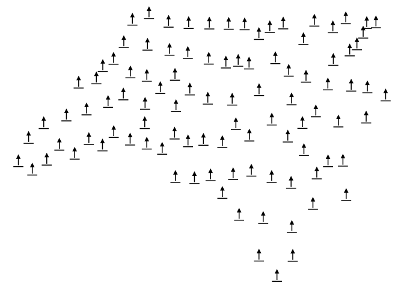

<!-- README.md is generated from README.Rmd. Please edit that file -->

# overedge

<!-- badges: start -->
<!-- badges: end -->

The goal of overedge is to provide useful functions for making maps with
R. This is a collection of miscellaneous functions primarily for working
with ggplot2 and sf.

## Installation

You can install the development version of overedge like so:

``` r
remotes::install_github("elipousson/overedge")
```

## Example

`overedge` currently provides a single function (`geom_sf_icon`) that
wraps `ggsvg::geom_point_svg()` to provide an convenient way to make
icon maps:

``` r
library(overedge)
library(ggplot2)
library(sf)
#> Warning: package 'sf' was built under R version 4.1.1
#> Linking to GEOS 3.9.1, GDAL 3.2.3, PROJ 7.2.1; sf_use_s2() is TRUE

nc <- st_read(system.file("shape/nc.shp", package="sf"))
#> Reading layer `nc' from data source 
#>   `/Library/Frameworks/R.framework/Versions/4.1-arm64/Resources/library/sf/shape/nc.shp' 
#>   using driver `ESRI Shapefile'
#> Simple feature collection with 100 features and 14 fields
#> Geometry type: MULTIPOLYGON
#> Dimension:     XY
#> Bounding box:  xmin: -84.32385 ymin: 33.88199 xmax: -75.45698 ymax: 36.58965
#> Geodetic CRS:  NAD27
ggplot() +
  geom_sf_icon(data = nc, icon = "point-start", size = 8) +
  theme_void()
#> Warning: Converting data from MULTIPOLYGON to POINT with `sf::st_centroid()`.
```


